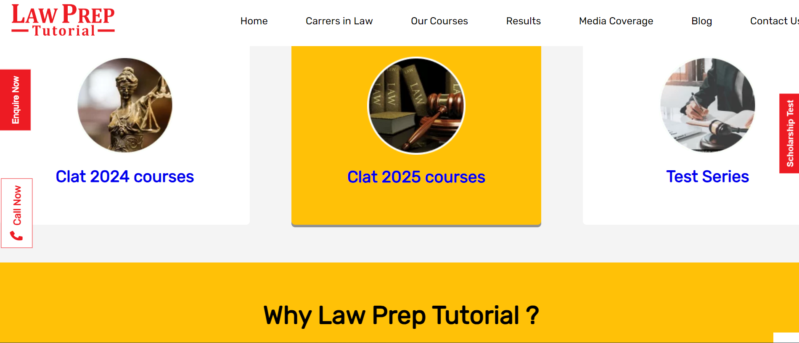
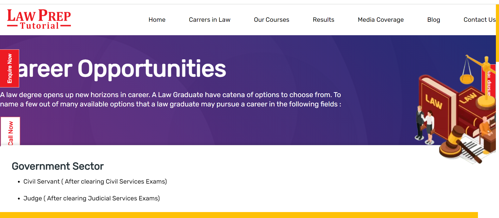
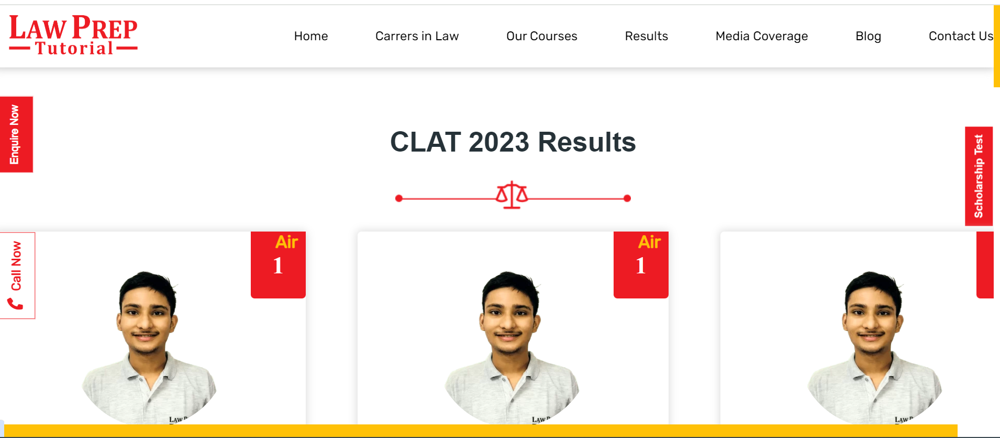
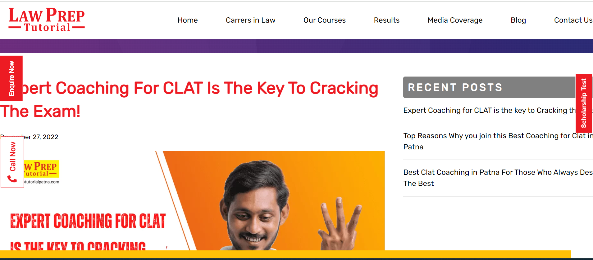
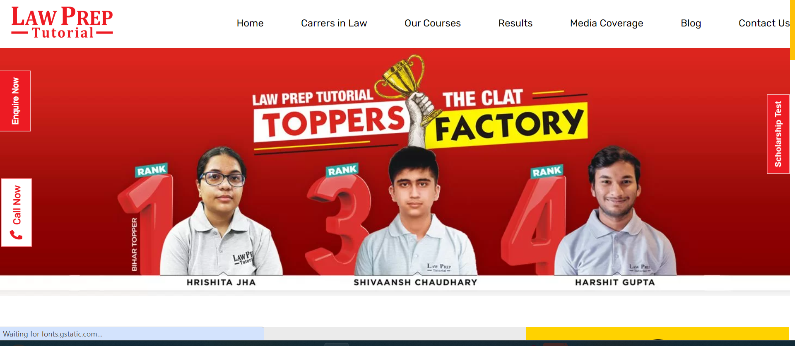

# lawprep
# Description

Law Prep Tutorial is the leading CLAT coaching institute in India. It offers strategic law entrance coaching to aspirants help crack their dream exams.Developed an interactive education website, using HTML, CSS, and JavaScript

* [GitHub Repository](https://github.com/LipikaManglaa/lawprep)
* [Deployed GitHub IO]  git@github.com:LipikaManglaa/lawprep.git

## Table of Contents

  
* [Description](#Description)

* [Technologies-Used](#Technologies-Used)

* [Screenshots](#Screenshots) 

* [Installation](#installation)
  
* [Instructions](#Instructions) 
          
* [Questions](#questions)
 
* [License](#license)  

### Technologies-Used
  *
  *HTML
  *CSS
  *JAVASCRIPT
 
 ### Screenshots
 Home Screen
   
 Career Screen
   

 Result Screen
   

 Blog Screen
   

 Contact Screen
   

### Installing

* To install this code, download the zip file, or use GitHub's guidelines to clone the repository. 

## Instructions
If you would like to see how to create Ecommerce API then you can check my github repo and let you know  how to cretae it

## License
This application is covered under the MIT license

## Questions
Created by: LipikaManglaa

If you have any further questions please feel free to contact me at lipika.mangla.web@gmail.com
